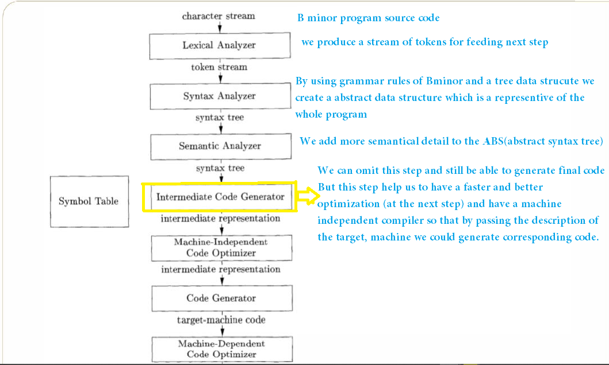

# Bminor-Compiler implemented with C 
[//]:# (pics/aut-logo.png)

  

This Project has implemented for "Compiler design" course, Tehran polytechnic university, Prof. Shirali Shahreza.

Our course was based on "Introduction to Compilers and Language Design, Second Edition, Prof. Douglas Thain, University of Notre Dame".
Visit the [home page](https://www3.nd.edu/~dthain/courses/cse40243/fall2019/) of this book for more info and getting an access to the pdf file of the book.

For implementing this project I've used [GitHub repo of Prof.Douglas Thain](https://github.com/dthain/compilerbook-examples) and [this repo](https://github.com/dthain/compilerbook-examples) . And also [Stanford compiler course website](https://web.stanford.edu/class/cs143/) and [these youtube unlisted videos](https://www.youtube.com/playlist?list=PLEAYkSg4uSQ3yc_zf_f1GOxl5CZo0LVBb) was insightful.

I'll adumbrate this project with a few lines and then elaberate on each part.
We have 6 majort part for implementing any compiler:

0. Understanding the structure of input language, in our case it's Bminor.
1. Lexical analyzing( Scanning, Tokenizing)
2. Syntax analyzing(Parsing)
3. Semantic analyzing
4. Intermediate code generation
5. Machine-independent code optimizing 
6. Code generating for the end point machine
7. Machine-dependent code optimizing

Compiling pipeline:

  

(For this course, implementing "Intermediate code, and optimizations were not necessary and has left for interested readers, perhaps you!)

Understanding the structure of input language
====
As we know, every programming language has its own structure and in order to undertanding(compiling) them we should have a preknowledge about their structure.
We can find more information about Bminor syntax [here](https://www3.nd.edu/~dthain/courses/cse40243/fall2019/bminor.html).

Requierments:
"gcc" , "C", "build-essential", "bison" , "flex", "nasm", and "make".
You can install in this way:

<code> sudo apt-get update  </code>

<code> sudo apt-get upgrade  </code>

<code> sudo apt-get install build-essential flex bison nasm </code>

Lexical analyzing( Scanning, Tokenizing)
====

